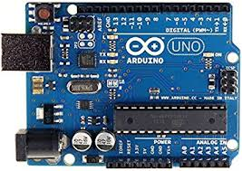
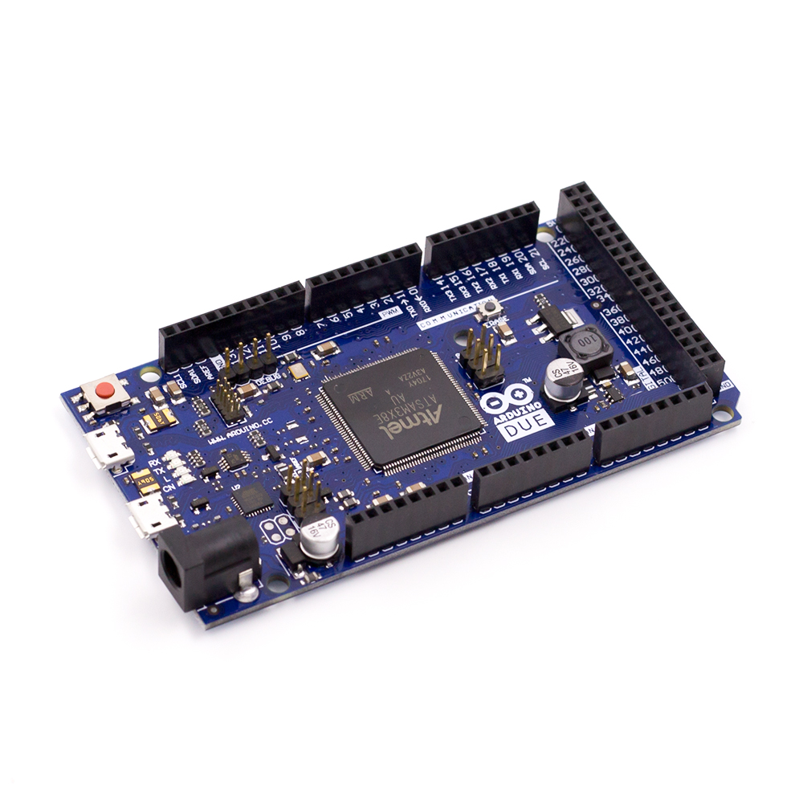
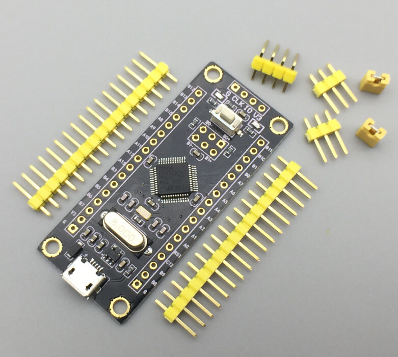
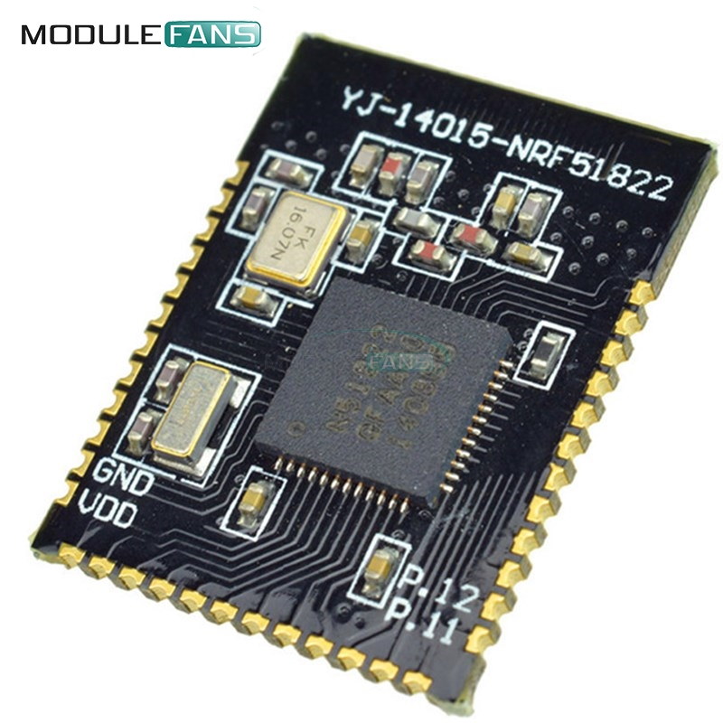

# platformio-docker
Build system for Arduino, STM32 and nRF5 IOT devices.
Specifically, I use the Uno (R3), Due, Blackpill (generic STM32F103C8T6) and YJ14015-NRF51822 boards.







This container contains the [platformio](https://platformio.org) a cross platform code builder and library manager with extensive support for IoT boards

The Dockerfile, 99-platformio-udev.rules and docker-entrypoint.sh files are used to build the docker image.

### Docker Image build instructions
Run this command:
```
docker build -t <"image_name"> .
```

### Using the docker image to build app

##### Interactive shell
You can launch an interactive shell and run through a srcEdit->build->upload->debug->srcEdit workflow. Example usage model of this workflow as follows:
```
mkdir ~/docker-data/pio-builds

docker run --rm --name pio-build -ti -h pio-build -v ~/docker-data/pio-builds:/home/build/builds \
[--device /dev/ttyUSB0:/dev/ttyUSB0] <name_you_give_to_image>

# A sample platformio.ini is available in /home/build/platformio.ini.template. To build a sample project

mkdir sample_project
cd sample_project
pio init
cp ../../platformio.ini.template platformio.ini
echo -e "void setup()\n{\n}\n\nvoid loop()\n{\n}\n" > scr/main.ino
pio run [-e uno]
```

##### Batch mode
Once source code is stable, the app can be built and uploaded directly as a oneshot docker image execution. The command will look like:

```
docker run --rm --name pio-build -ti -h pio-build -v ~/docker-data/pio-builds:/home/build/builds \
--device /dev/ttyACM0:/dev/ttyUSB0 <name_you_give_to_image> bash -c 'cd <your_project>' && \
pio run -e uno -t upload --upload-port /dev/ttyUSB0'
```

